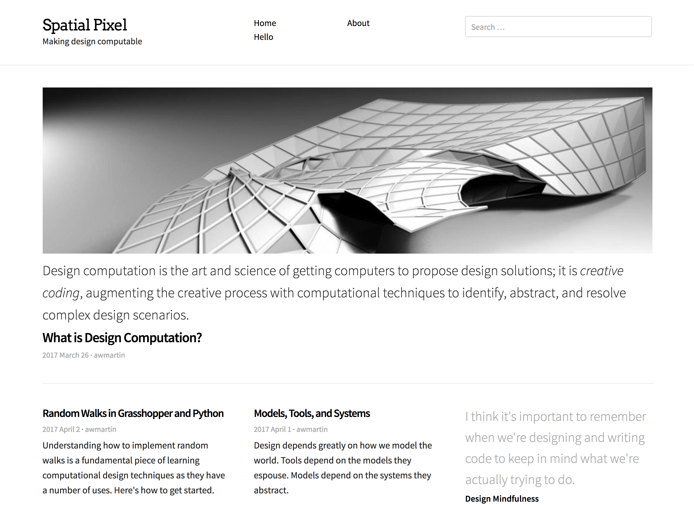

# Spatial Pixel

A simple Wordpress theme built on the [_Null_ Wordpress Framework](https://github.com/awmartin/null-framework).

## Preview

## Description

Spatial Pixel is a clean theme designed for readability amidst a sleek, sans-serif look. The home and archive pages are designed for fast perusal and skimming, while the single pages are built for long reads.

## Features

**Post types.** For quotes, for example, include a file `single-quote.php` and fill it out with a Null template, like copying `single-standard.php`.

**Featured images.** A post's feature image shows up in the home and archive pages as a thumbnail in the smaller entry. It's also featured at the top of the single page.

**Sticky posts.** Sticky posts on the front page are displayed large at the top. I recommend you use only one sticky post.

**Highlighted first paragraph.** Put a `<!--more-->` tag after the first paragraph in a post or page, and that paragraph will show up as the page's excerpt in index and archive pages.

**Meta description.** Includes code to set the `<meta name="description">` tag in the `<head>` automatically to the page's excerpt or the site's description.

**Supported Wordpress features.**

- Custom backgrounds
- Post formats
- Feature images
- Sticky posts

**Supported Null Framework features.**

- Breadcrumb
- Google Analytics
- [Schema.org](http://schema.org/) Markup

## Dependencies

- [Null Framework](https://github.com/awmartin/null-framework/)
- [Skeleton](getskeleton.com) CSS boilerplate

## Customizing

Since **Spatial Pixel** uses the Null framework, it's quite easy to customize without writing any HTML.

## License

MIT License.

## Contributing

Pull requests are welcome!
